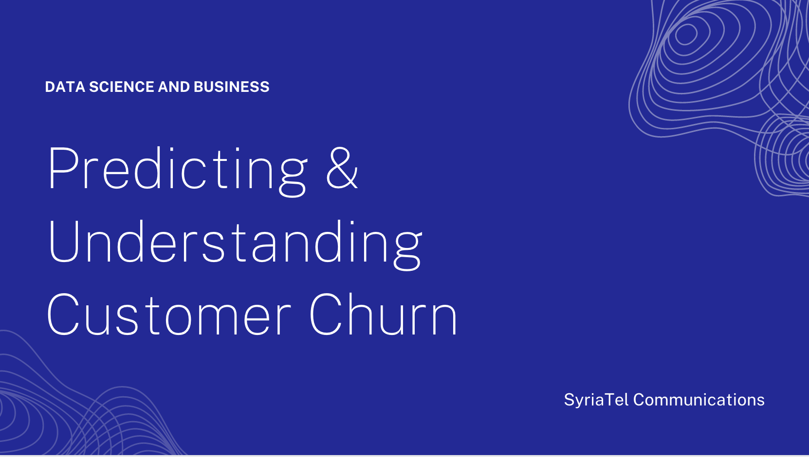
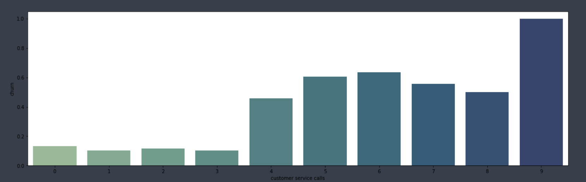
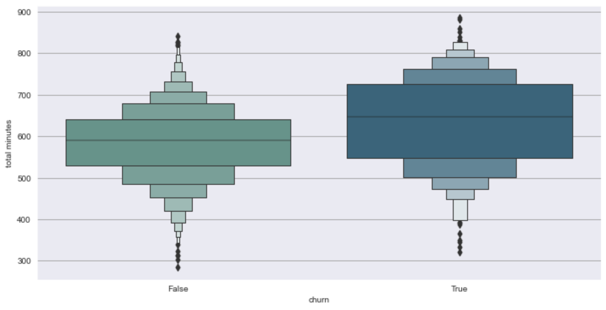
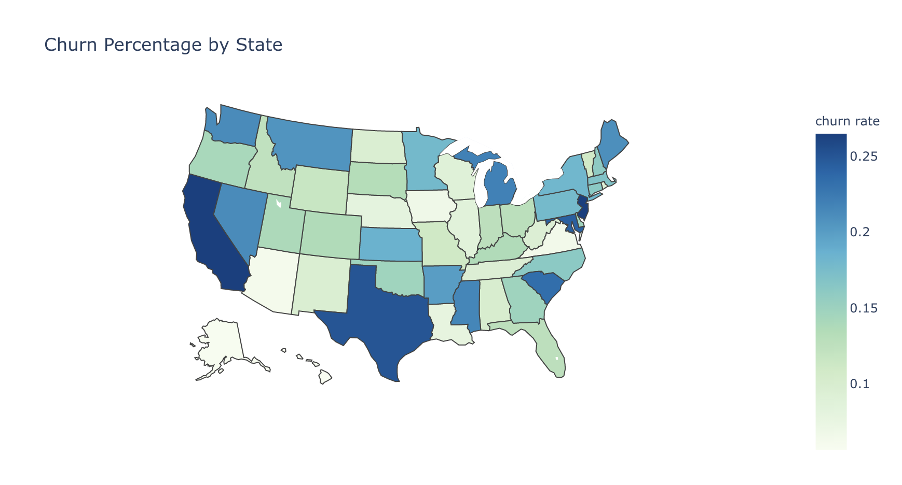
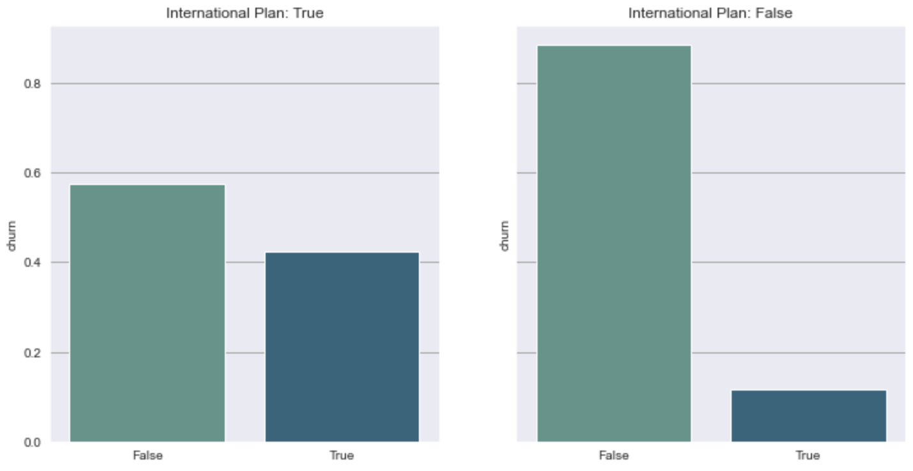
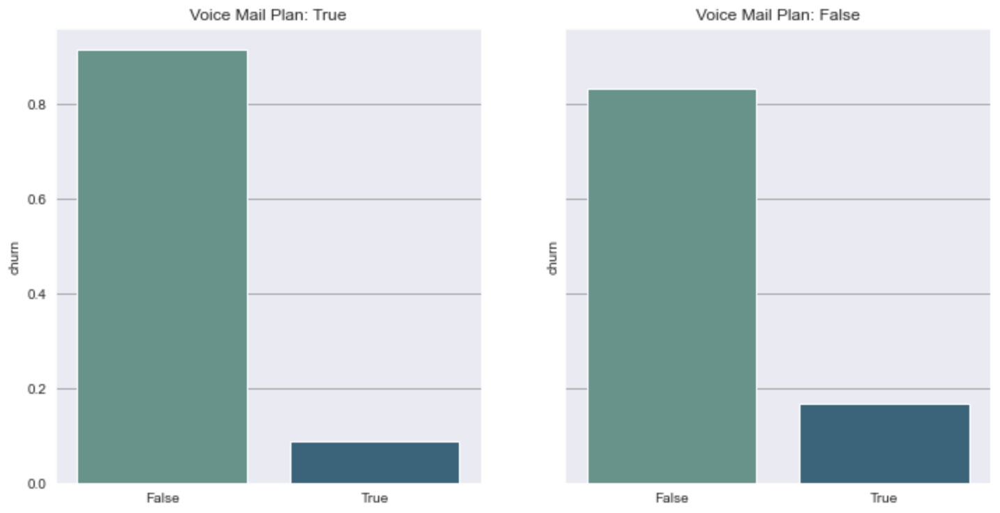
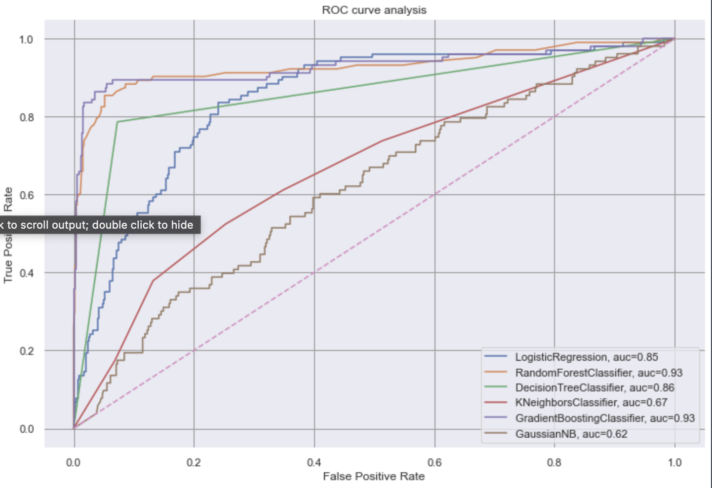
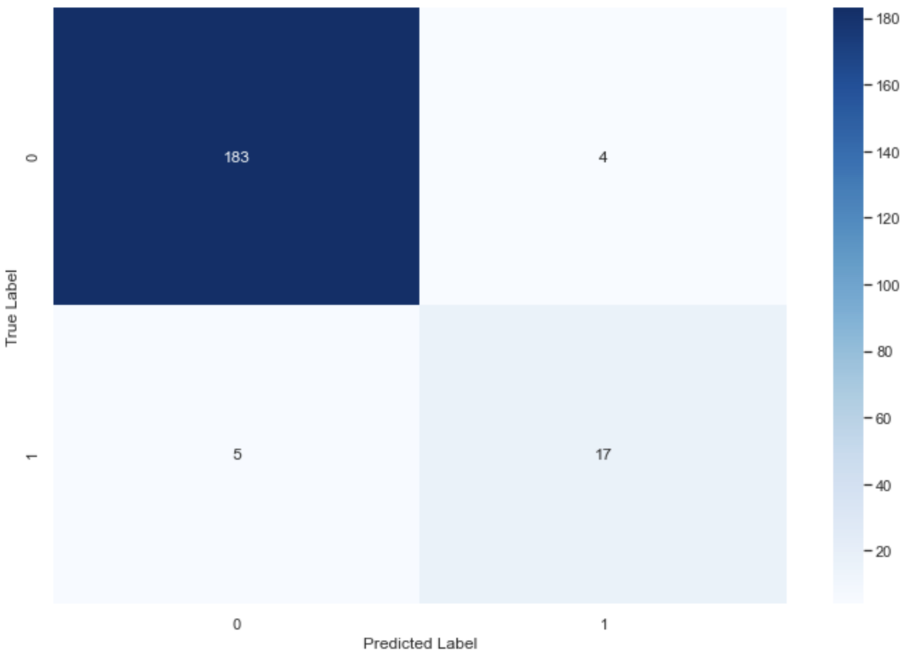
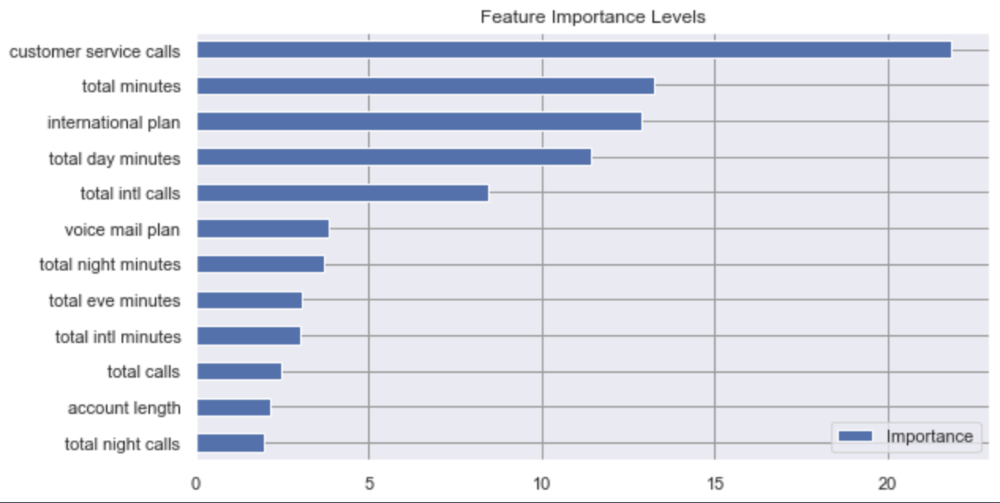

# Hi! This project is to build a model that will predict customer churn.



# Index

* [Overview](#Overview)
* [Exploratory Data Analysis](#Exploratory-Data-Analysis)
* [Churn Classification Model](#Churn-Classification-Model)
* [Next Steps](#Next-Steps)
* [Repository Structure](#Repository-Structure)

# Important Links

* [Slideshow Presentation](https://github.com/kai-cansler/phase-3-final-customer-churn/blob/main/presentation.pdf)
* [Jupyter Notebook](https://github.com/kai-cansler/phase-3-final-customer-churn/blob/main/notebook.ipynb)

# Overview

SyriaTel Communications, a telecommunications firm, looks to predict and decrease customer churn, which refers to customers discontinuing their services with the company. Customer churn is a significant challenge for service-oriented businesses due to its high costs. The company not only losses the customer's payments but also bears expenses related to acquiring new customers to offset the loss.

In understand SyriaTel's customer churn issue, I began with Exploratory Data Analysis (EDA) to understand our customers that churn. We then tested and developed a machine learning classifier. This classifier is tuned to forecast potential customer churn, enabling SyriaTel to devise a more effective strategy to prevent customer churn.

In the EDA I aim to answer the following questions:
* What are signs that point to potential churn?
* What can we learn about clients in different areas?
* How do clients respond to our different plans and how do they use them?
 
**Data Understanding**

I used the churn in telecoms dataset in this project, this can be found in the data folder, and was downloaded from [churn in telecom dataset on kaggle](https://www.kaggle.com/becksddf/churn-in-telecoms-dataset). This dataset contains 21 features including the target and 3333 observations. The data set was pretty clean without large outliers or misspelled categories and with normal distributions.

# Exploratory Data Analysis

## What are signs that point to potential churn?
---

**Reporting:**

The churn rate for the training set of our data is roughly 14.5%. If we were to guess that every client will not churn we will be acurate 85.5% of the time. We aim to create a model with higher accuracy and the best possible recall score.

We found that:
1. Clients with *higher volume of service calls* also have an *higher churn rate* among those observations. We can see that potentially number of customer service calls increases the *likelihood* of churning increases as well. The observed churn rate increases signficantly of customers with greater than 4 calls. This rate jumps from roughly 4% to 50% and more.



Customer service calls does not guarantee customer churn, as most customers who remained loyal had 1-2 service calls. Clients conducting more than 3 calls should be considered a warning sign that indicates a higher likelihood of customer churn. It is important to keep in mind that the majority of customers who did churn had made 1-4 calls to customer service.



Number of 

**Recommendation:** 

In response to our discovery:
1. I suggest a reassessment of our customer service experience. 
2. Consider implementing an offer or discount for customers who have passed the threshold of 3 calls to customer service or inquire on canceling their service. This strategic adjustment aims to proactively address potential churn and enhance customer retention.
3. Understand the reason to why customers called service and whether those cases were resolved.

## What can we learn about clients in different areas?

**Reporting:**

States have different degrees of churn rates. Upon categorizing by state, California and New Jersey have the highest churn rate at 27%, surpassing all other states. Texas also experience higher rates of churn at about 25%. Conversely, states with the lowest churn rates encompass Hawaii and Arkansas, both have near 5%.



There may be be a few explanations for the difference in churn among states. 
1. Presence of big competitors with different prices and wider range of solutions in places California, New Jersey, and Texas. Another reason could be the lack of presence in those states or decreased service as their populations are higher.
2. States such as Hawaii and Arkansas have lower population as well as more rural areas and may not have as many competitors, decreasing their options.

**Recommendations**

1. I would recommend conducting a survey on competitors in California, New Jersey, and Texas and compare their offerings that might lead our customers to churn. 
2. I also recommend looking into the cell signal and latency in these states with higher churn as they have higher populations and can be more densly populated in certain cities.

## How do clients respond to our different plans and how do they use them?

**Reporting**

The number of calls conducted for both customers that churn and do not churn are approximately identical. Looking at the number of minutes though we can see a higher call lengths for those that churn. 
1. We can understand that for average usage the churn rate is the same.
2. The longer their calls the higher the charge so those who make longer calls either care more or use more in their day-to-day activities and are more inclined to shop for competitive deals.
   




Customers who has an international plan are also significantly more likely to churn that those without. 
1. The rates for international minutes are the same regardless of whether the customer has an international plan or not ($0.27/min).
2. With no benefit to charge for international calls, it is possible that the customers who churned felt that there was no benefit to paying for an international plan.





Customers who have a voice mail plan are less likely to churn than those without. Customers who subscribe to a beneficial service apart from their normal service are more likely to stay. This may be because they are more integrated with our services and switching may cause a higher negative. 

**Recommendation**

1. We should look into the rates we charge for normal calls and do a cost benefit analysis to identify opportunities to make our services mroe competitive. 
2. I recommend adding a better rate for international minutes for those with the plan. If a customer has an international plan, they should have cheaper rates for international calls than a customer without an international plan.
3. Promoting the voice mail plan will be beneficial. The more clients we have subscribed to our voice mail plan will create better our chances of retaining clients.

## Exploratory Data Analysis Summary

In summary, customer service calls strongly signal potential churn. Certain states exhibit higher churn, though the reasons are unclear. Additionally, dissatisfaction with international plans is evident, with customers having such plans more prone to churn compared to those without.


# Churn Classification Model

The final model was chosen with a Gradient Boosting classifier for it's higher performance in recall score compared to other classifiers. This model performed with a recall score of 77%.


    
## Performance Metric

Recall score was our primary identifier in a successful model. Recall is the ratio of a succesfully predicted True Positive and all True Positives. Our business understanding is that losing a client is more costly than gaining a new client. In this case we want to minimize our misclassification of a client who will churn. If we are able to implement a customer retention strategy on those who are identified to churn along with cost of providing a discount or offer to those who did not have an intention to churn will out way the cost of customer acquisition.

 

## Model Score

The final model was implemented on our testing and validation set for performance:
* Validation Recall Score 0.77
* Testing Recall Score 0.81

The recall score does not differ much between the validation and test set. This is success on our efforts to minimize overfitting. Only 5 False Negatives and 4 False Positive were classified by the model from the validation set. The models accuracy is 96% which is 10.5% higher than the 85.5% accuracy we would have if were to guess that everyone would retain a customer. With the model we are able to better identify and retain clients who will churn.

## Important Features

Let's take a look at the models most valuable features for classification. 



## Model Conclusion

In conclusion, based on this model's recall score, using this model to predict the churn of SyriaTel's customers will allow us to identify clients that would churn that if we did not. This will provide us an opportunity to learn more about improving our services and implement a strategy to retain our clients.


# Next Steps

We would investigate the following:

* Get more data regarding competitors in states with higher churn
* Get more data on cell signal across the US to look for patterns in states with higher churn
* Collect more data to improve our classification model.
* Create a pipeline to improve workflow classification of new data.

# Repository Structure

```
├── notebook.ipynb
├── data
│   ├── telecom_churn_data.csv
├── visualisations
│   ├── customer_service_calls_and_churn.png
│   ├── cust_service_box_plot.png
│   ├── state_churn_map.png
│   ├── intl_plan_churn
│   ├── voicemail_plan_churn.png
│   ├── roc_comparison.png
│   ├── validation_confusion_matrix.png
│   └── feature_importances.png
├── images
│   └── cover.png
├── presentation.pdf
└── README.md
```
